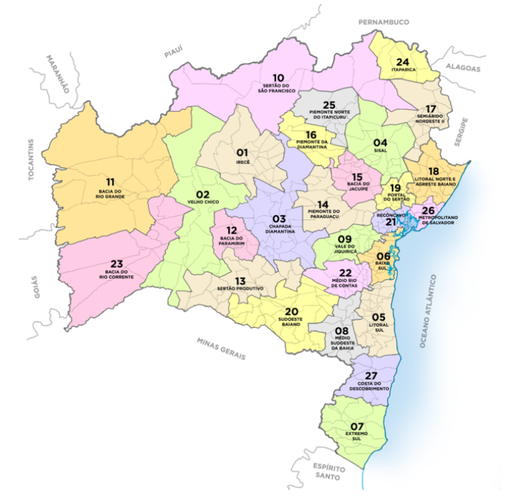

# Projeto Caixeiro Viajante 

## Descrição

Este projeto tem como objetivo resolver o problema do Caixeiro Viajante (Travelling Salesman Problem - TSP) especificamente para o estado da Bahia, Brasil. O TSP é um dos problemas mais clássicos e estudados em otimização combinatória, onde o desafio é encontrar o menor caminho que passa por todas as cidades exatamente uma vez e retorna à cidade de origem.

A ideia é utilizar o mapa das regiões da bahia como referência.


URL: http://www.cultura.ba.gov.br/modules/conteudo/conteudo.php?conteudo=314
## Estrutura do Projeto

```
.
├── data
│   ├── coords.csv        # Arquivo CSV contendo as coordenadas das cidades da Bahia
│   ├── custo.csv         # Arquivo CSV contendo o custo de deslocamento entre as cidades
├── src
│   ├── algoritmos
│   ├── visualizacao
│   └── distancia.py                 # Arquivo utilizado para gerar a matriz de custos
├── README.md
└── requirements.txt
```

## Tecnologias Utilizadas

- Python 3.8+
- Bibliotecas:
  - pandas
  - numpy
  - matplotlib
  - seaborn
  - scikit-learn

## Como Usar

1. Clone o repositório:

   ```sh
   git clone https://github.com/seu_usuario/caixeiro-viajante-bahia.git
   cd caixeiro-viajante-bahia
   ```

## Organização dos Dados

Os dados das cidades da Bahia estão armazenados no arquivo `data/cidades_bahia.csv`, que contém as seguintes colunas:

- `cidade`: Nome da cidade
- `latitude`: Latitude da cidade
- `longitude`: Longitude da cidade

## Algoritmos Implementados

Em andamento....